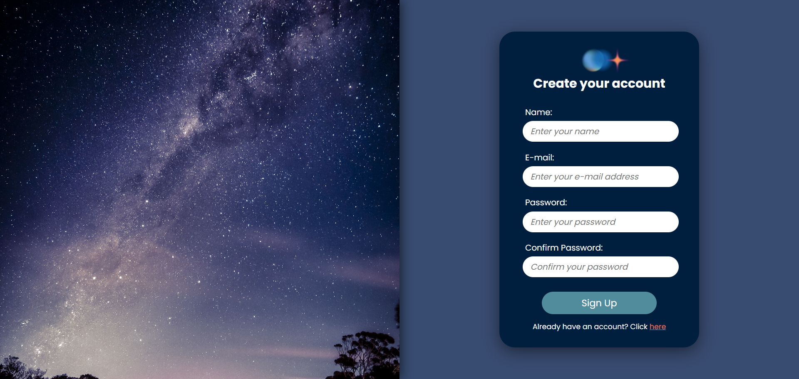
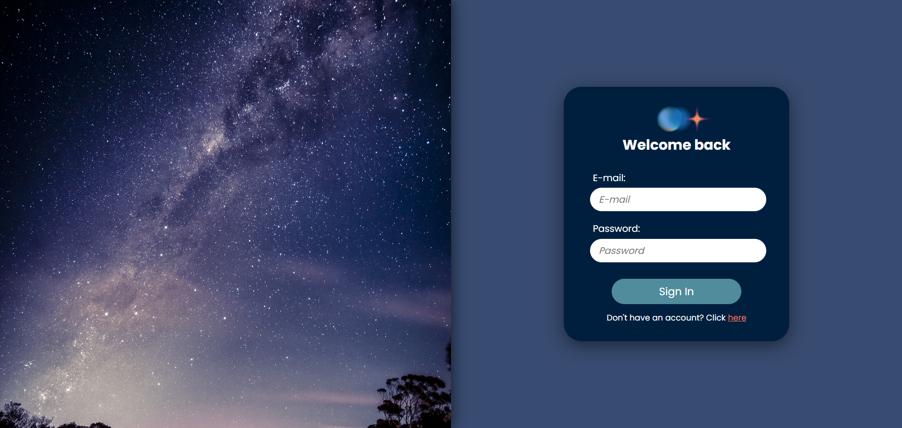
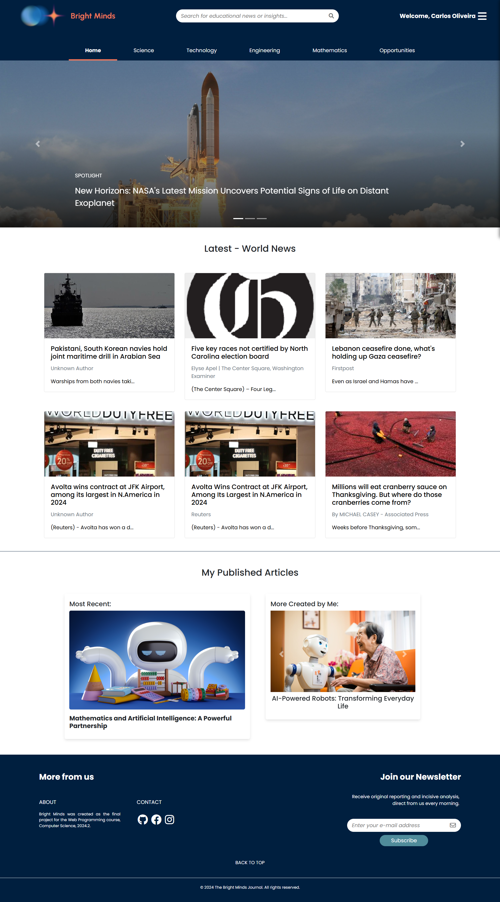
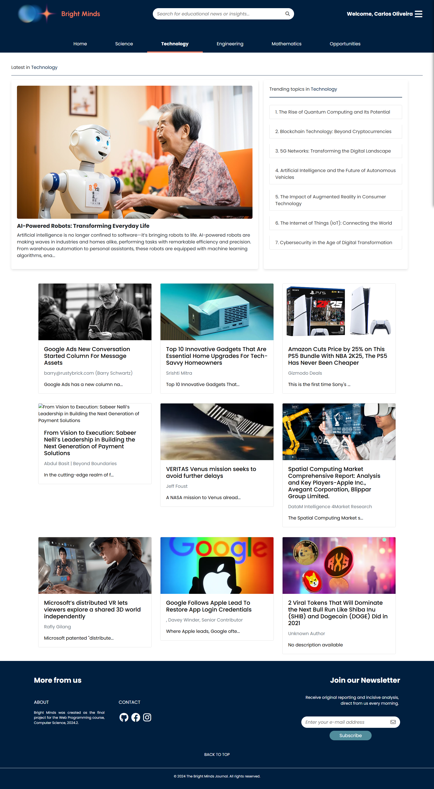
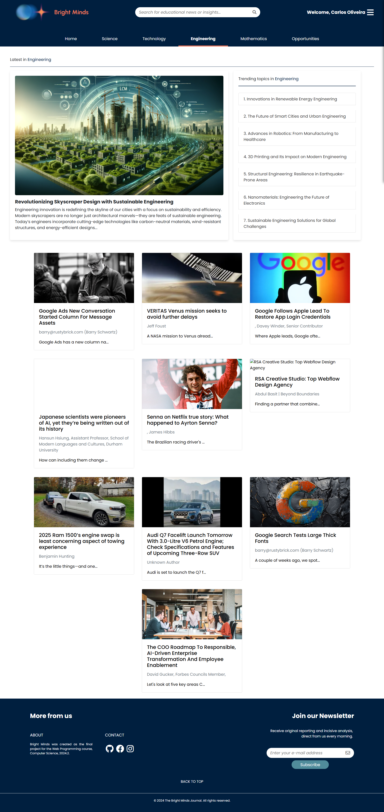
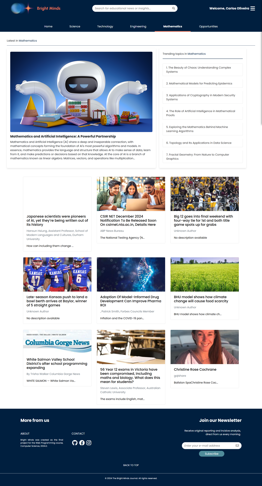
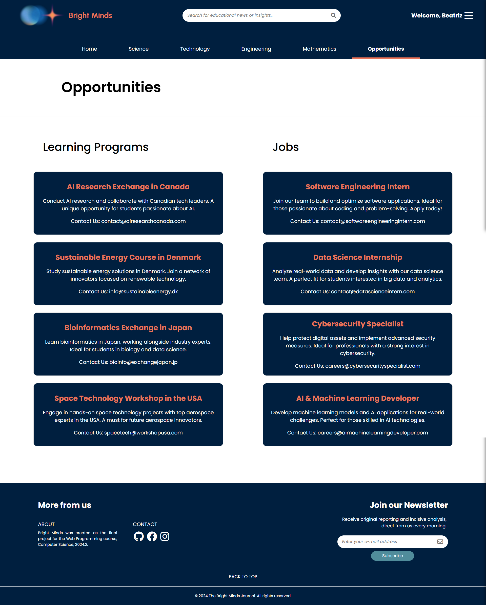
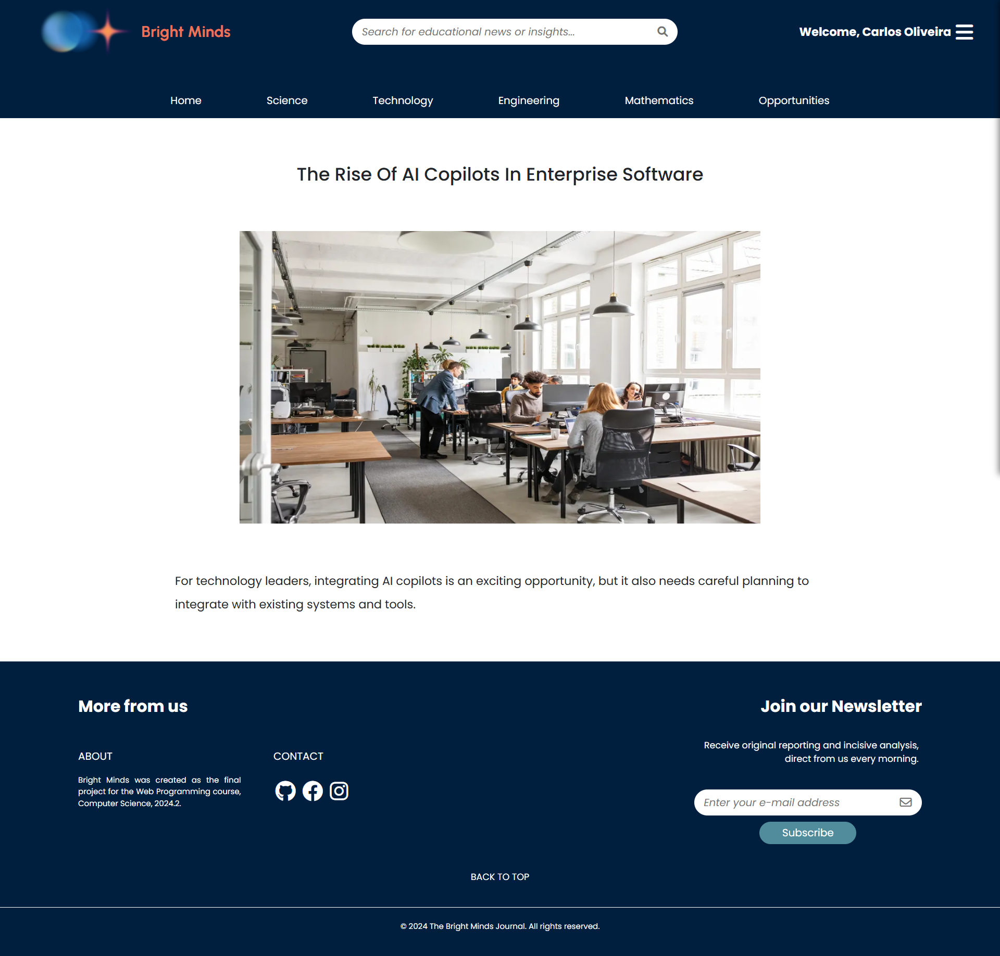

# ✨ Bright Minds – Programação Web

O projeto Bright Minds foi desenvolvido como trabalho final da disciplina de Programação Web do curso de Ciência da Computação, semestre 2024.2. O objetivo foi criar um portal de notícias e artigos educativos voltado para a área de STEM (Ciência, Tecnologia, Engenharia e Matemática), utilizando PHP puro, HTML, CSS e JavaScript.

Bright Minds visa oferecer conteúdo atualizado e de qualidade sobre temas relevantes em STEM, ajudando estudantes e profissionais a se manterem informados sobre as últimas tendências e inovações nessas áreas.

---

## Componentes
- Telas de log-in e sign up
- Tela inicial (Home)
- Telas de notícias dos temas Ciência, Tecnologia, Engenharia e Matemática (STEM)
- Tela de oportunidades de estudos e emprego
- Tela de submeter novo artigo
- Tela de notícia aberta

---

## Como usar
**1. Clone o repositório:**
```
git clone https://github.com/carlos-oliveira087/web-programming-project
```

**2. Abra o arquivo "01-signup-structure.html"**

---

## Capturas de tela

### Desktop:
<table>
  <tr>
    <td></td>
    <td></td>
  </tr>
  <tr>
    <td></td>
    <td></td>
  </tr>
  <tr>
    <td></td>
    <td></td>
  </tr>
  <tr>
    <td></td>
    <td></td>
  </tr>
</table>


---

### Autores
Alexandre Bruno Palitot Martins<br>
Beatriz Almeida de Souza Silva<br>
Hugo Lins Pedrosa<br>
Ian Mendonça Madruga de Carvalho<br>
José Carlos Oliveira<br>
Rigel Sales de Souza<br><br>
Novembro de 2024.